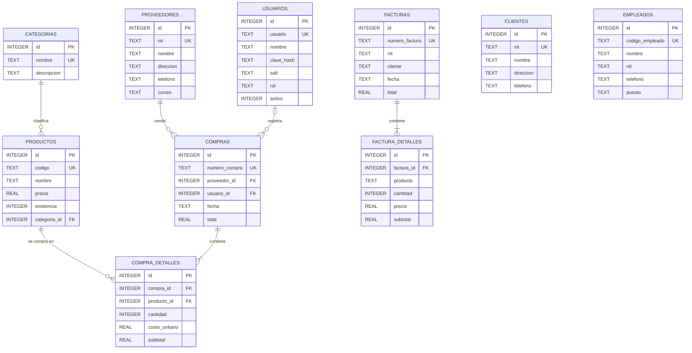

# Diagrama entidad-relación

Base de datos SQLite `datos/sistema_ventas.db`, con **10 tablas**. `ConexionBD` crea las tablas al arrancar y activa las llaves foráneas (`PRAGMA foreign_keys = ON`).

## Reglas de las llaves foráneas

| Relación | Al borrar el registro padre |
|---|---|
| `productos.categoria_id → categorias.id` | `SET NULL`: el producto queda sin categoría |
| `compras.proveedor_id → proveedores.id` | Se impide: no se borra un proveedor con compras |
| `compras.usuario_id → usuarios.id` | `SET NULL`: la compra se conserva sin usuario |
| `compra_detalles.compra_id → compras.id` | `CASCADE`: se borran los detalles con la compra |
| `compra_detalles.producto_id → productos.id` | Se impide: no se borra un producto con compras |
| `factura_detalles.factura_id → facturas.id` | `CASCADE`: se borran los detalles con la factura |

## Notas

- `facturas` guarda el NIT y el nombre del cliente como texto, y `factura_detalles` guarda el nombre del producto. Es el diseño original de la tarea 3 y sirve como "foto" de la venta. Por eso **clientes** y **empleados** no tienen llave foránea hacia las facturas.
- `usuarios.clave_hash` guarda un hash PBKDF2-SHA256 (120 000 iteraciones), cada uno con su propia sal (`salt`). Las contraseñas nunca se guardan en texto plano.
- `usuarios.rol` solo admite `ADMINISTRADOR` o `VENDEDOR` (restricción `CHECK`).
- Si una base se creó con una versión anterior, se actualiza sola al abrir el sistema: se crean las tablas nuevas y la columna `productos.categoria_id`, sin perder datos.
