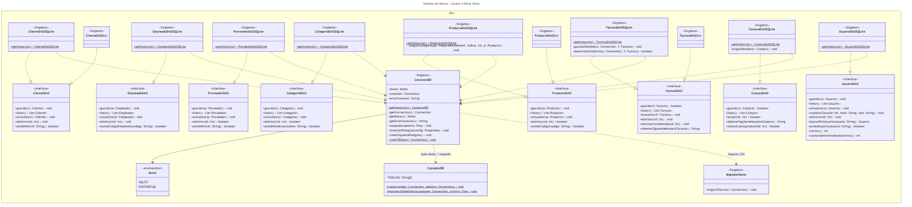
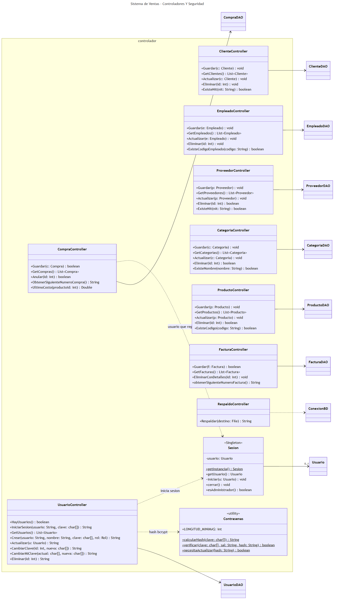
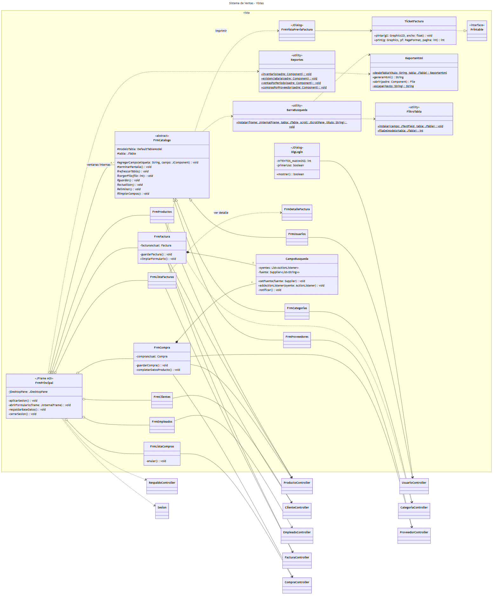
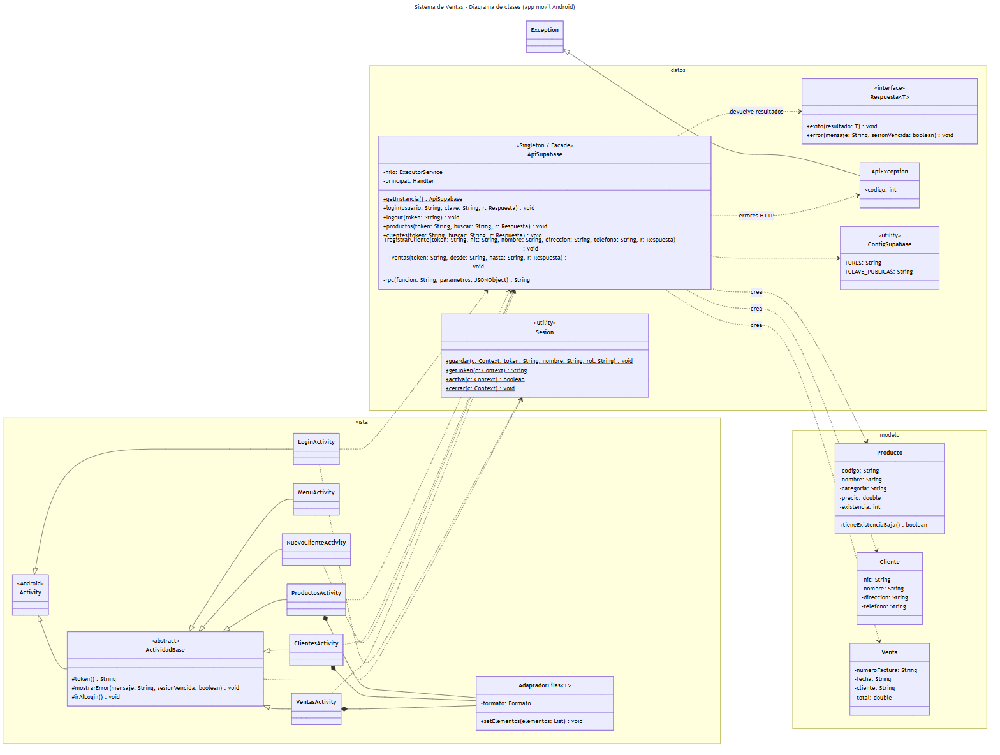

# Diagrama de clases UML

Refleja el **código actual** (fases 1 a 16). Los nombres y firmas se tomaron del código compilado con `javap`, así que coinciden con las clases implementadas.

| Archivo | Contenido |
|---|---|
| [`diagrama-clases.mmd`](diagrama-clases.mmd) | Diagrama **completo** de la app de escritorio, en Mermaid (para editar o exportar) |
| [`diagrama-clases-movil.mmd`](diagrama-clases-movil.mmd) | Diagrama de la app **móvil** Android |
| [`img/`](img/) | Imágenes PNG por capa, listas para proyectar o imprimir |

**Convenciones:**
- Visibilidad: `+` público, `-` privado, `#` protegido, `~` de paquete.
- Métodos: `$` estático, `*` abstracto.
- **Getters y setters omitidos**: todas las entidades los tienen, y listarlos no aporta información.
- Relaciones:

| Símbolo | Significado |
|---|---|
| `<\|--` | Herencia |
| `*--` | Composición |
| `o--` | Agregación |
| `-->` | Asociación |
| `..>` | Dependencia (uso) |
| `..\|>` | Realización (implementa una interfaz) |

El diagrama completo tiene unas 60 clases y en una sola imagen no se lee. Por eso se presenta **por capas**, siguiendo el patrón MVC.

## 1. Modelo (entidades del negocio)


- **Herencia:** `Persona` es abstracta y de ella heredan `Cliente`, `Empleado` y `Proveedor`. `Empleado` y `Proveedor` sobrescriben `mostrarInformacion()` (polimorfismo).
- **Composición:** `Factura` ◆— `FacturaDetalle` y `Compra` ◆— `CompraDetalle`. El detalle no existe sin su documento.
- **Asociaciones:**
  - `Factura` → `Cliente`
  - `FacturaDetalle` → `Producto` (0..1: se puede facturar un producto escrito a mano)
  - `CompraDetalle` → `Producto`
  - `Compra` → `Proveedor` y `Usuario`
  - `Producto` → `Categoria`
- **Sobrecarga:** `Factura.agregarDetalle(...)` tiene dos versiones.

## 2. Acceso a datos (patrón DAO + Singleton)



- Cada entidad tiene una **interfaz DAO** y una implementación JDBC (`…DAOSQLite`, que funciona con SQLite y con PostgreSQL). Las implementaciones son **Singleton**.
- `…DAOCsv` son las implementaciones del entregable de listas y archivos. Siguen cumpliendo la misma interfaz, y eso demuestra que la implementación se puede cambiar sin tocar el resto.
- `ConexionBD` (Singleton) elige el motor según `config/bd.properties` y crea las tablas.
- `CopiadorBD` sube los datos a la nube y hace los respaldos; `MigradorDatos` importa los CSV antiguos.

## 3. Controladores y seguridad



- Cada controller trabaja **con la interfaz** DAO, no con la implementación.
- `UsuarioController` concentra el inicio de sesión y las reglas de los usuarios. Usa `Contrasenas` (hash bcrypt) y `Sesion` (Singleton con el usuario conectado).
- `CompraController` toma de `Sesion` el usuario que registra la compra.

## 4. Vistas (Swing, MDI)



- `FrmPrincipal` es el contenedor **MDI**: agrega todas las ventanas internas.
- `FrmCatalogo` es **abstracta**, con el patrón *Template Method*: `FrmCategorias`, `FrmProveedores` y `FrmUsuarios` heredan de ella.
- `CampoBusqueda` es un componente reutilizable: `FrmFactura` y `FrmCompra` tienen dos cada uno. Aplica el patrón Observer (`addActionListener`).
- `TicketFactura` implementa `Printable`: el mismo dibujo sirve para la vista previa y para imprimir.
- Cada vista usa **solo controllers**, nunca DAO ni SQL.

## 5. App móvil (Android)



- `ApiSupabase` es Singleton y fachada (*Facade*): esconde HTTP, JSON e hilos. Devuelve los resultados por la interfaz genérica `Respuesta<T>` (*callback*).
- `ApiException` es una **excepción propia** que guarda el código HTTP.
- `ActividadBase` es **abstracta** y exige sesión en todas las pantallas que heredan de ella.
- `AdaptadorFilas<T>` es una clase **genérica** para las listas.

## Cómo editar y regenerar las imágenes

1. Editar `diagrama-clases.mmd` o `diagrama-clases-movil.mmd`. Para verlo, se puede pegar en https://mermaid.live/.
2. Exportar a PNG:
   ```
   npx @mermaid-js/mermaid-cli -i diagrama-clases.mmd -o img/diagrama.png -s 2 -b white
   ```

> **Historia:** la versión anterior de este diagrama (tareas 5 y 6) tenía solo `Persona`, `Cliente`, `Empleado`, `Producto`, `Factura` y `FacturaDetalle`, con sus DAO, controllers y vistas. Sus imágenes siguen en `tareas/06-…/` como evidencia de esa entrega.
