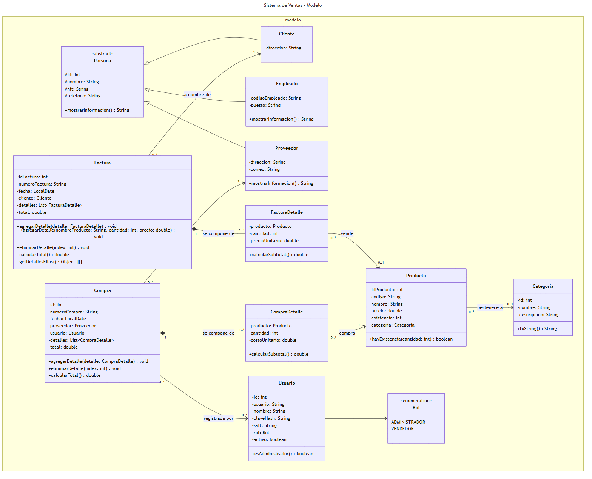
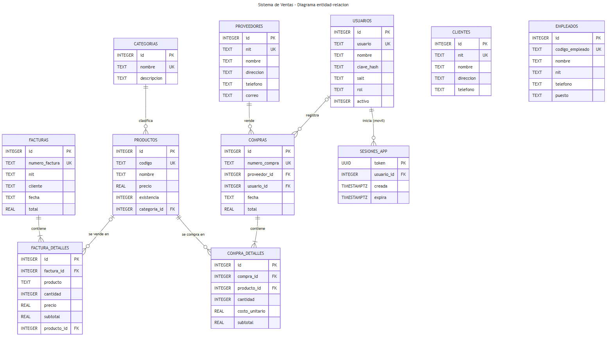

# Revisión presencial de avance del proyecto

**Curso:** Programación II · Universidad Mariano Gálvez
**Proyecto:** Sistema de Ventas (facturación e inventario)
**Repositorio:** https://github.com/jzetinob/sistema-ventas

Esta página resume el avance según los criterios de la rúbrica y enlaza cada evidencia.

**Presentación:** [presentacion-avance-sistema-ventas.pptx](presentacion-avance-sistema-ventas.pptx) · [versión PDF](presentacion-avance-sistema-ventas.pdf). Tiene 10 diapositivas; cada una lleva sus notas para el expositor, y la última incluye el guion de la demostración.

---

## 1. Diagrama de clases (0.75)

Está al día con el código implementado: los nombres y firmas se tomaron del código compilado.

| Vista | Imagen |
|---|---|
| Modelo (entidades) | [clases-1-modelo.png](../../docs/diagramas/img/clases-1-modelo.png) |
| Acceso a datos (DAO + Singleton) | [clases-2-acceso-a-datos.png](../../docs/diagramas/img/clases-2-acceso-a-datos.png) |
| Controladores y seguridad | [clases-3-controladores.png](../../docs/diagramas/img/clases-3-controladores.png) |
| Vistas (MDI) | [clases-4-vistas.png](../../docs/diagramas/img/clases-4-vistas.png) |
| App móvil | [clases-5-movil.png](../../docs/diagramas/img/clases-5-movil.png) |

Explicación de cada vista: [docs/diagramas/diagrama-clases.md](../../docs/diagramas/diagrama-clases.md).



## 2. Diagrama entidad-relación (0.75)

Tiene 10 tablas con llaves primarias, llaves únicas y 7 relaciones de llave foránea, cada una con su regla (CASCADE, SET NULL o RESTRICT). Coincide con el script que crea la base: `sistema-ventas/src/main/resources/bd/esquema-postgresql.sql`, y la versión SQLite en `ConexionBD`.



Detalle y reglas de borrado: [docs/diagramas/diagrama-entidad-relacion.md](../../docs/diagramas/diagrama-entidad-relacion.md).

## 3. MDI, menú y navegación (0.75)

`FrmPrincipal` es un formulario **MDI**: un `JDesktopPane` con ventanas internas (`JInternalFrame`). Tiene este menú:

| Menú | Opciones |
|---|---|
| **Archivo** | Nueva factura, Ver facturas, Cambiar mi contraseña, Cerrar sesión, Salir |
| **Catálogos** | Productos, Empleados, Clientes, Categorías, Proveedores |
| **Compras** | Nueva compra, Ver compras |
| **Edición** | Limpiar formulario |
| **Ventana** | Cascada, Mosaico, Minimizar todo, Restaurar todo, Tema (automático por hora, claro, oscuro) |
| **Administración** | Usuarios, Respaldar base de datos |
| **Reportes** | Resumen con gráficos, Inventario, Existencia baja, Ventas por período, Compras por proveedor |
| **Ayuda** | Acerca de |

El menú se adapta al rol: el **Vendedor** solo ve facturación y clientes.

## 4. Formularios y operaciones (1.25)

| Formulario | Operaciones | Persistencia |
|---|---|---|
| Productos, Clientes, Empleados, Categorías, Proveedores, Usuarios | Guardar, Actualizar, Eliminar, Buscar, Reporte HTML | Base de datos PostgreSQL (Supabase) o SQLite, mediante JDBC y DAO |
| Factura | Registrar venta con detalle, imprimir ticket | Transacción: encabezado + detalles + descuento de existencia |
| Lista de facturas | Consultar, ver detalle, eliminar (devuelve la existencia), reporte | Base de datos |
| Compra | Registrar compra a proveedor con detalle | Transacción: encabezado + detalles + suma de existencia |
| Lista de compras | Consultar, ver detalle, anular, reporte | Base de datos |
| Resumen | Ventas del día y del mes, gráfico de barras de la semana y dona de más vendidos | Consultas agregadas a la base |
| Inicio de sesión | Login con roles; creación del administrador en el primer uso | Tabla `usuarios` (contraseñas bcrypt) |

## 5. Flujo funcional e integración (1.00)

Los datos registrados en un formulario se usan en otros:

```
Categorías ──► Productos (categoría)
Proveedores ─┐
Productos ───┴─► Compra ──► suma existencia del producto
Clientes ────┐
Productos ───┴─► Factura ──► descuenta existencia · no deja vender sin existencia
Facturas / Compras ──► Reportes y Resumen con gráficos (ventas por período, compras por proveedor, inventario)
Todo lo anterior ──► App móvil (misma base): consulta productos, clientes y ventas; registra clientes y facturas
Factura hecha en el celular ──► aparece en Ver facturas y descuenta existencia en el escritorio
```

## 6. Documentación de apoyo

- [Manual de usuario (PDF)](../../entregables/manual-usuario.pdf) · [Manual técnico (PDF)](../../entregables/manual-tecnico.pdf)
- [Historial de desarrollo por fases](../../docs/proyecto/historial-de-desarrollo.md)
